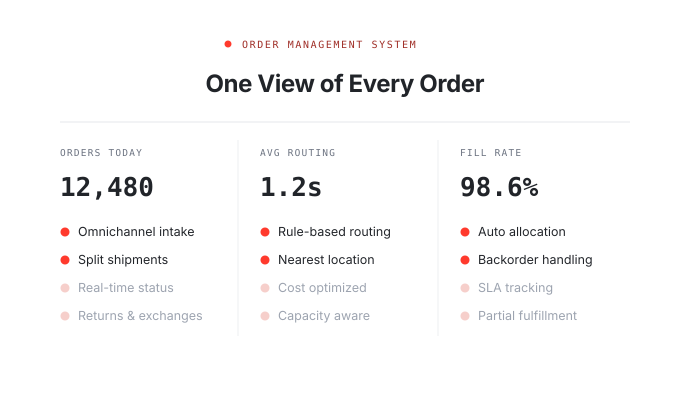

# HotWax Hero Banner

An animated hero banner for HotWax Systems: headline, CTA, a rotating showcase
of solution cards with floating info chips, and a client logo strip.

Ships in two forms — a **standalone** static page, and a **HubSpot custom
module** where everything is editable from the sidebar.



---

## Contents

```
hotwax-hero-banner/
├── index.html                    standalone page
├── styles.css                    standalone styles
├── script.js                     standalone carousel
├── assets/
│   ├── hero/                     card artwork + floating chips (SVG)
│   ├── clients/                  client logos
│   └── brand/                    HotWax Systems logo
└── hubspot/
    ├── README.md                 upload + field guide
    ├── preview.html              renders the module markup locally
    └── hotwax-hero.module/       the uploadable module
        ├── meta.json
        ├── fields.json           the editor sidebar
        ├── module.html           HubL markup
        ├── module.css
        └── module.js
```

## Run it locally

```bash
cd hotwax-hero-banner
python3 -m http.server 8899
```

- Standalone: <http://127.0.0.1:8899/>
- HubSpot module preview: <http://127.0.0.1:8899/hubspot/preview.html>

Hard-refresh (**Cmd+Shift+R**) after editing CSS — the dev server sends no
cache headers, so browsers hold on to the old stylesheet.

## Use it in HubSpot

See [hubspot/README.md](hubspot/README.md). Short version:

```bash
npm install -g @hubspot/cli
hs init
hs upload hubspot/hotwax-hero.module "hotwax-hero.module"
```

Then drag **HotWax Hero Banner** onto any page.

---

## How the animation works

Four cards rotate on a timer. The choreography is modelled on the Chargebee
homepage banner:

| Piece | Behaviour |
|---|---|
| **Leave** | The outgoing card stays fully opaque, moves to `z-index: 1` (**in front**) and slides a full card-height down while un-rotating flat, over `1s ease-in-out`. The next card is revealed beneath it — there is no crossfade. |
| **Tilt** | The stack tilts `rotateX(11°) rotateY(±11°) rotate(∓3.5°)` and alternates direction each slide, swinging over the same `1s`. |
| **Back layers** | Two layers sit behind the card at `translateZ(-38px)` and `-19px`, offset sideways only. They peek out on the leaning side and swap sides with the tilt. |
| **Chips** | Fade and rise in on a springy curve, staggered `0.2s → 1.2s` so they arrive one after another. |
| **Stage bar** | Only the stage on screen is highlighted; the connector fills red as its slide plays. |

Dwell is **5s per card**, set by `DURATION` in [script.js](script.js) (standalone)
or the **Seconds per card** slider (module).

### Things that are deliberate

Each of these fixes a specific visual bug — changing them will bring it back:

- **Layers offset sideways only, never vertically.** A downward offset makes them
  protrude below the card across its full width, so they show on the empty side too.
- **Shadows are directional per lean.** A centred blur (`0 40px 80px`) spills out
  of *both* edges and reads as a phantom layer on the empty side.
- **The stack has `margin-bottom: -58px`** at ≥768px. That pushes the rotated
  bottom corners past the panel's `overflow: hidden` so they're shaved off
  instead of showing as diagonals. Raise it if you increase the tilt.
- **Headline gradients use `background-image`, not `background`.** The shorthand
  resets `background-clip` and paints a solid block over the text.
- **Full-bleed uses a JS-measured width**, not `100vw` — `100vw` includes the
  scrollbar and causes a stray horizontal scrollbar.
- **Card images are sized by the container, not their own dimensions.** An image
  at its natural width overflowed the viewport on mobile.

## Content notes

- The four card graphics and the chip figures (12,480 orders, 98.6% fill rate,
  $2.4M savings …) are **illustrative placeholders**, not real HotWax data.
  Replace them with real screenshots or verified numbers before publishing.
- The client logos in `assets/clients/` are HotWax Systems' real clients, taken
  from hotwaxsystems.com: Essilor, Herman Miller, Warby Parker, cabi, United,
  Winning Group, Ware2Go and Spoonful of Comfort.
- Brand palette: accent `#FF3A2D`, ink `#212429`, deep red `#9F2D26`.

## Browser support

Modern evergreen browsers. Uses CSS 3D transforms, `aspect-ratio` and
`backdrop-filter`. Motion is disabled under `prefers-reduced-motion`, and the
carousel pauses on hover, on keyboard focus, when scrolled out of view, and when
the tab is in the background.
